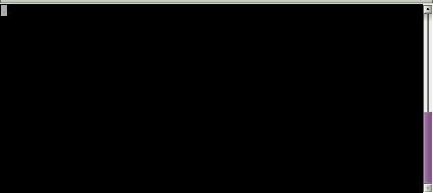

# asyncBash

Make "async" calls from your bash prompt and get the results back in the same command line

#Install

```bash
cd ~/yourDir
git clone https://github.com/liloman/asyncBash
echo ". ~/yourDir/asyncBash/asyncBash.sh" >> ~/.bashrc
```

If you have like me a multiline prompt you can set this variable to your extra `PS1` lines, in my case:

```bash
asyncBash_prompt_command_lines=2 
```

#Use

It cames with 3 predefined keybindings.

* Ctrl-r/s search for a substring argument in history (I have waited for something alike for years)


* Alt-h-l/f shows a cheatsheet for the last/first command. Empty to show all  hints. (I have maden it along the tutorial below :D)


* Ctrl-h command number, uses relative history expansion (I have needed it thousand of times)


* Alt-r run current cli without scrolling, show errors on red and let select visually the output (just a step behind to power autocompletions for example... ;) )




#Tutorial

Let's make a simple keybinding that displays a hint below the `PS1` when the user presses `Alt-h`.
Suppose you want to display your custom hint/cheatsheet for the current command just below your `PS1`.

Your goal is something like:

```bash
$>journalctl -xr (pressed Alt-h)
 Press Ctl-q to clean the screen messages
 DATES
 -b: shows current boot
 --list-boots: list boots
 -b -N: previous N boot
 --since yesterday/09:00/"2015-01-10"
 --until yesterday/09:00/"2015-01-10"/"2015-01-10 17:15:00"
 PROCESS
 -u nginx.service
 _PID=444  / _UID=345 /  SYSLOG_IDENTIFIER=firejail / ...
```

##Make the static keybind for our function

NOTE: \e is Alt/M- for keybindings
All the user stuff will be added to my_fun.sh, search for BINDS and add:

```bash
##################
#  STATIC BINDS  #
##################

...
#Display a cheatsheet for the current command
asyncBash:Create_Static_Keybinding "\eh" "show_command_hints"
```

So now, we have make almost all the keybindings (there's one left `ctl-q` ).

##Make the bash function

The next step is to make the function. Let's search for Functions and add: :)


```bash
###############
#  Functions  #
###############

#Display a cheatsheet for the current command
#from ~/.local/share/asyncBash/hints
show_command_hints() {
    asyncBash:Add_Msg_Below_PS1 "I will show you a nice cheatsheet"
}
```

Hooray it works:

```bash
$>tell me (pressed Alt-h)

I will show you a nice cheatsheet
```

So let's fill it:

```bash
#Display a cheatsheet for the current command
#from ~/.local/share/asyncBash/hints
show_command_hints() {
    [[ -z $asyncBash_current_cmd_line ]] && return
    #Clean possible previous asyncBash calls
    asyncBash:Clean_Screen_Below_PS1
    local -a cmda=($asyncBash_current_cmd_line)
    local cmd=${cmda[0]}
    asyncBash:Add_Msg_Below_PS1 "I will show you a nice cheatsheet for $cmd"
    #Substitute command line
    asyncBash:Substitute_Command_Line "${cmda[@]}"
}
```

```bash
$>tell me (pressed Alt-h)

I will show you a nice cheatsheet for tell
```

So basically we check that there is a current command, clean possible previous messages from this framework and get the first command on the current command line.
We need now just check for a file in certain path a just show it!. :D
Let's say that ~/.local/share/asyncBash/hints/$cmd.txt is our path:

```bash
#Display a cheatsheet for the current command
#from ~/.local/share/asyncBash/hints
show_command_hints() {
    [[ -z $asyncBash_current_cmd_line ]] && return
    #Clean possible previous asyncBash calls
    asyncBash:Clean_Screen_Below_PS1
    local -a cmda=($asyncBash_current_cmd_line)
    local cmd=${cmda[0]}
    local file="$HOME/.local/share/asyncBash/hints/$cmd.txt"
    asyncBash:Add_Msg_Below_PS1  "I will show you a nice cheatsheet for $cmd"
    while IFS= read -r line; do 
        asyncBash:Add_Msg_Below_PS1 "$file"
    done < $file
    #Substitute command line
    asyncBash:Substitute_Command_Line "${cmda[@]}"
}
```

Let's try it:

```bash
$>journalctl (pressed Alt-h)

I will show you a nice cheatsheet for journalctl
DATES
-b: shows current boot
--list-boots: list boots
-b -N: previous N boot
--since yesterday/09:00/"2015-01-10"
--until yesterday/09:00/"2015-01-10"/"2015-01-10 17:15:00"
PROCESS
-u nginx.service
_PID=444  / _UID=345 /  SYSLOG_IDENTIFIER=firejail / ...
```

Wow. :D

Basically we have read the file line by line (proper way in bash), added each line to a queue to be displayed below the PS1 and finally rewrite the command line without the first '#', so 100% equal.

There is an obvious error we don't check for the file but the important is that there is a keybinding remaining already (did you remember `Ctl-q` to clean the screen?).


```bash
#Display a cheatsheet for the current command
#from ~/.local/share/asyncBash/hints
show_command_hints() {
    [[ -z $asyncBash_current_cmd_line ]] && return
    #Clean possible previous asyncBash calls
    asyncBash:Clean_Screen_Below_PS1
    local -a cmda=($asyncBash_current_cmd_line)
    local cmd=${cmda[0]}
    local file="$HOME/.local/share/asyncBash/hints/$cmd.txt"
    if [[ -e $file  ]]; then
        #make the keybind, just call a bash function, so nothing fancy this time
        bind -x '"\C-q": asyncBash:Clean_Screen_Below_PS1'
        #show a legend with the possible arguments (fixed msg)
        asyncBash:Add_Msg_Below_PS1  "Enter Control-q to clean screen messages" yes
        while IFS= read -r line; do 
            asyncBash:Add_Msg_Below_PS1  "$line"
        done < $file
    fi
    #Substitute command line
    asyncBash:Substitute_Command_Line "${cmda[@]}"
}
```

Ummm:


```bash
$>journalctl -rb (pressed Alt-h)
Enter Control-q to clean screen messages
DATES
-b: shows current boot
--list-boots: list boots
-b -N: previous N boot
--since yesterday/09:00/"2015-01-10"
--until yesterday/09:00/"2015-01-10"/"2015-01-10 17:15:00"
PROCESS
-u nginx.service
_PID=444  / _UID=345 /  SYSLOG_IDENTIFIER=firejail / ...

```

And then: 

```bash
$>journalctl -rb (pressed Ctr-q)

```

Here we are!.


It's so easy, nice and simple that I've made it along this tutorial and added to the default user functions. :rocket:

#HOW

100% bash scripting with a little help of tput. ;)

#FAQ

Why wasn't it invented before?

Now it is! :roller_coaster:


# TODO
- [x] Visual selection of output
- [ ] Autocompletion with visual selection 
- [ ] Bash Snippets
- [ ] Visual movement (like tmux visual mode)
- [ ] Copy certain output line to clipboard?
- [ ] Unit testing?


#FIXED

1. ~~output when scrolling is needed~~
2. ~~chained calls with scroll~~
